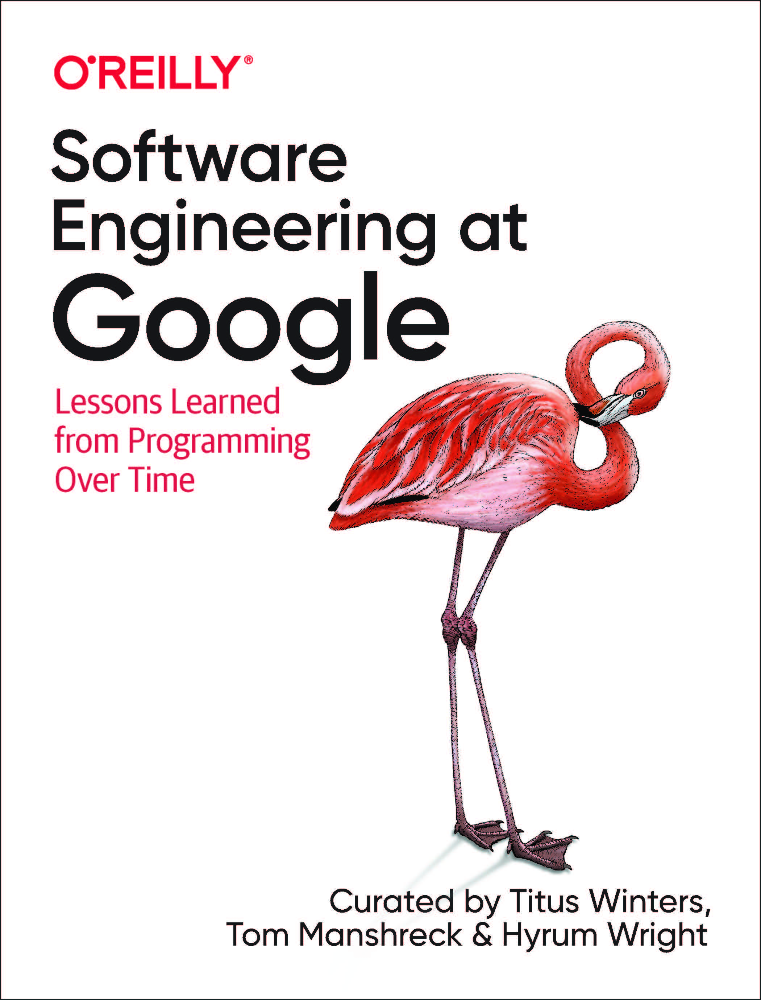

# Software-Engineering-at-Google

《Software Engineering at Google》的中文翻译版本。

## 书籍介绍

by **Titus Winters, Tom Manshreck, and Hyrum Wright**

当前国内已经有中文版书籍出版了，大家需要更加准确，推荐大家去购买。

## 为什么翻译

目前 GitHub 上并没有对《Software Engineering at Google》的中文翻译。加之本人的英语也不好，好不容易看了一遍，似有所有领悟，想要再看一遍的时候，发现满眼都是英文，实在是痛苦！    

为了让自己也让更多的中文读者有更好的阅读体验，学习到当前人类最为复杂系统是如何开发和维护的知识。    

本人边看边记录翻译和学习笔记。  

## 在线阅读

https://qiangmzsx.github.io/Software-Engineering-at-Google/#/

## 当前状态

| PART              | 部分          | 章节                                               | 名称                                                         | 状态       | 翻译人员                                 | 计划完成时间   | 备注                                                         |
| ----------------- | ------------- | -------------------------------------------------- | ------------------------------------------------------------ | ---------- | ---------------------------------------- | -------------- | ------------------------------------------------------------ |
| Foreword          | 序言          |                                                    | [序言](./zh-cn/Foreword.md)                                  | 完成校验 | @qiangmzsx                               |                |                                                              |
|                   | 前言          |                                                    | [前言](./zh-cn/Preface.md)                                   | 完成校验 | @qiangmzsx                               |                |                                                              |
| PART 1 Thesis     | 第一部分 理论 | chapter 1 : What Is Software Engineering?          | [第一章：软件工程是什么？](./zh-cn/Chapter-1_What_Is_Software_Engineering/Chapter-1_What_Is_Software_Engineering.md) | 完成校验 | @qiangmzsx                               | 2021-12-02     | 2021-11-30 完成。 统一将政策改为策略                        |
| PART 2 Culture    | 第二部分 文化 | chapter 2 : How to Work Well on Teams              | [第二章：如何融入团队](./zh-cn/Chapter-2_How_to_Work_Well_on_Teams/Chapter-2_How_to_Work_Well_on_Teams.md) | 完成校验 | @qiangmzsx                               | 2021-12-20     | 2021-12-02 完成                                              |
|                   |               | chapter 3 : Knowledge Sharing                      | [第三章：知识共享](./zh-cn/Chapter-3_Knowledge_Sharing/Chapter-3_Knowledge_Sharing.md) | 完成校验 | @qiangmzsx                               | 2021-12-20     | 2021-12-05 完成                                              |
|                   |               | chapter 4 : Engineering for Equity                 | [第四章：公平工程](./zh-cn/Chapter-4_Engineering_for_Equity/Chapter-4_Engineering_for_Equity.md) | 完成校验 | @qiangmzsx                               | 2021-12-20     | 我现在还很难区分『平等』和『公平』。 平等和公平的区别：性质不同。本义不同。平等：指人们在社会、政治、经济、法律等方面享有相等待遇。公平：处理任何事情合情合理，不会偏袒哪一方面。 扩展资料： 性质不同：公平”是一种手段,“平等”是一个结果。 本义不同：平等强调的是无差别，而公平则强调公道、公正、不偏袒。或者说，是否承认存在差别，构成了公平与平等最主要的区别。平等否认存在差别，而公平则不然，它承认存在差别，并在此基础上得以实现。 平等意思：它是人和人之间的一种关系、人对人的一种态度，它是人类的终极理想之一。由于人之差异绝对的公平不存在，只有相对的平等，现代社会的进步就是人和人之间从不平等走向平等过程是平等逐渐实现的过程，遇到不道德之处一定要坚决消灭。 公平指公正，不偏不倚。平是指所有的参与者（人或者团体）的各项属性（包括投入、获得等）平均。公为公正、合理，能获得广泛的支持；平指平等、平均。 由于人之差异而没有绝对的公平，只有相对的公平。 |
|                   |               | chapter 5 : How to Lead a Team                     | [第五章：如何领导团队](./zh-cn/Chapter-5_How_to_Lead_a_Team/Chapter-5_How_to_Lead_a_Team.md) | 完成校验 | @qiangmzsx | 2022-05-02 |                                                              |
|                   |               | chapter 6 : Leading at Scale                       | [第六章：规模优先](./zh-cn/Chapter-6_Leading_at_Scale/Chapter-6_Leading_at_Scale.md) | 完成校验 | @FingerLiu                               | 2022-04-06     |                                                              |
|                   |               | chapter 7 : Measuring Engineering Productivity     | [第七章：测量工程效率](./zh-cn/Chapter-7_Measuring_Engineering_Productivity/Chapter-7_Measuring_Engineering_Productivity.md) | 完成校验 | @qiangmzsx                      | 2022-05-23 |  |
| PART 3 Processes  | 第三部分 流程 | chapter 8 : Style Guides and Rules                 | [第八章：风格指导和规则](./zh-cn/Chapter-8_Style_Guides_and_Rules/Chapter-8_Style_Guides_and_Rules.md)      | 完成校验     | @ll13                                    | 2022-04-18 |                                                              |
|                   |               | chapter 9 : Code Review                            | [第九章：代码审查](./zh-cn/Chapter-9_Code_Review/Chapter-9_Code_Review.md) | 完成校验 | @qiangmzsx                               | 2022-04-04     |                                                              |
|                   |               | chapter 10 : Documentation                         | [第十章：文档](./zh-cn/Chapter-10_Documentation/Chapter-10_Documentatio.md) | 完成校验 | @qiangmzsx                               | 2022-01-15     | 1、概述，大略地叙述，对文章或事物进行概括表达。在百度百科里，特指词条概述，对已有信息进行简明归纳。 2、概念：人类在认识过程中，从感性认识上升到理性认识，把所感知的事物的共同本质特点抽象出来，加以概括，是自我认知意识的一种表达，形成概念式思维惯性。在人类所认知的思维体系中最基本的构筑单位。 |
|                   |               | chapter 11 : Testing Overview                      | [第十一章：测试概述](./zh-cn/Chapter-11_Testing_Overview/Chapter-11_Testing_Overview.md) | 完成校验 | @qiangmzsx                               | 2022-04-15     |                                                              |
|                   |               | chapter 12 : Unit Testing                          | [第十二章：单元测试](./zh-cn/Chapter-12_Unit_Testing/Chapter-12_Unit_Testing.md) | 完成待校验 | @qiangmzsx                               | 2022-03-19     |                                                              |
|                   |               | chapter 13 : Test Doubles                          | [第十三章：测试替代](./zh-cn/Chapter-13_Test_Doubles/Chapter-13_Test_Doubles.md) | 完成校验 | @qiangmzsx                               | 2022-02-11完成 |                                                              |
|                   |               | chapter 14 : Larger Testing                        | [第十四章：大型测试](./zh-cn/Chapter-14_Larger_Testing/Chapter-14_Larger_Testing.md) | 完成校验 | @qiangmzsx                               |                |                                                              |
|                   |               | chapter 15 : Deprecation                           | [第十五章：废弃](./zh-cn/Chapter-15_Deprecation/Chapter-15_Deprecation.md) | 完成校验 | [jixiufeng](https://github.com/jixiuf)   |                |                                                              |
| PART 4 Tools      | 第四部分 工具 | chapter 16 : Version Control and Branch Management | [第十六章：版本控制和分支管理](./zh-cn/Chapter-16_Version_Control_and_Branch_Management/Chapter-16_Version_Control_and_Branch_Management.md) | 完成校验 | @qiangmzsx                               | 2022-04-07     |                                                              |
|                   |               | chapter 17 : Code Search                           | [第十七章：代码搜索](zh-cn/Chapter-17_Code_Search/Chapter-17_Code_Search.md) | 完成校验 | [caili](https://github.com/transfercai)  | 2022-02-16     |                                                              |
|                   |               | chapter 18 : Build Systems and Build Philosophy    | [第十八章：构建系统，构建理念](./zh-cn/Chapter-18_Build_Systems_and_Build_Philosophy/Chapter-18_Build_Systems_and_Build_Philosophy.md) | 完成校验 | @qiangmzsx                               | 2022-01-26     | 构件（功能模块化，前提是接口标准化）；组件对数据和方法的简单封装。 |
|                   |               | chapter 19 : Critique : Google’s Code Review Tool  | [第十九章：体验：谷歌的代码审查工具](./zh-cn/Chapter-19_Critique_Googles_Code_Review_Tool/Chapter-19_Critique_Googles_Code_Review_Tool.md) | 完成校验 | @qiangmzsx                               | 2022-01-30     |                                                              |
|                   |               | chapter 20 : Static Analysis                       | [第二十章：静态分析](./zh-cn/Chapter-20_Static_Analysis/Chapter-20_Static_Analysis.md) | 完成待校验 | @yangjun                                 | 2022-04-24 |                                                              |
|                   |               | chapter 21 : Dependency Management                 | [第二十一章：依赖管理](./zh-cn/Chapter-21_Dependency_Management/Chapter-21_Dependency_Management.md) | 完成待校验 | @qiangmzsx                               | 2022-03-013    |                                                              |
|                   |               | chapter 22 : Large-Scale Changes                   | [第二十二章：大规模变更](./zh-cn/Chapter-22_Large-Scale_Changes/Chapter-22_Large-Scale_Changes.md) | 完成待校验 | @qiangmzsx                               | 2022-03-10     | 宠物类比的是传统服务器或虚拟机，每一个都被照顾得很好，不可或缺，不会自动变得有序。牛比的是云端服务器实例，量多、可替代、短生命周期，可以自动变得有序。 |
|                   |               | chapter 23 : Continuous Integration                | [第二十三章：持续集成](./zh-cn/Chapter-23_Continuous_Integration/Chapter-23_Continuous_Integration.md) | 完成待校验 | @qiangmzsx                               | 2022-03-06     |                                                              |
|                   |               | chapter 24 : Continuous Delivery                   | [第二十四章：持续交付](./zh-cn/Chapter-24_Continuous_Delivery/Chapter-24_Continuous_Delivery.md) | 完成待校验 | @qiangmzsx                               | 2022-03-08     |                                                              |
|                   |               | chapter 25 : Compute as a Service                  | [第二十五章：计算即服务](./zh-cn/Chapter-25_Compute_as_a_Service/Chapter-25_Compute_as_a_Service.md) | 完成待校验 | @qiangmzsx                               | 2022-02-23     |                                                              |
| PART 5 Conclusion | 第五部分 总结 | Afterword                                          | [后记](./zh-cn/Afterword.md)                                 | 完成待校验 | @qiangmzsx                               | 2022-01-26完成 |                                                              |

## Star

## 授权许可

除特别声明外，本书中的内容使用 [CC BY-SA 3.0 License](http://creativecommons.org/licenses/by-sa/3.0/)（创作共用 署名-相同方式共享3.0 许可协议）授权，代码遵循 [BSD 3-Clause License](https://github.com/astaxie/build-web-application-with-golang/blob/master/LICENSE.md)（3 项条款的 BSD 许可协议）。
